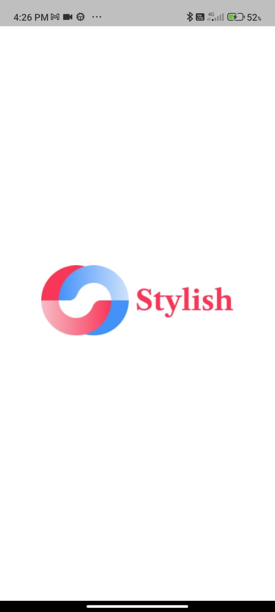
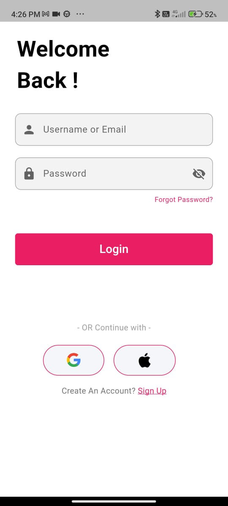
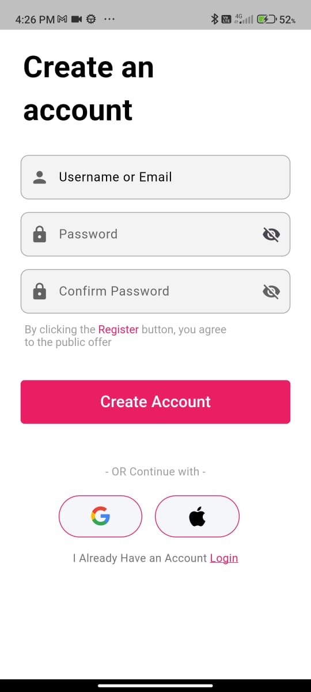
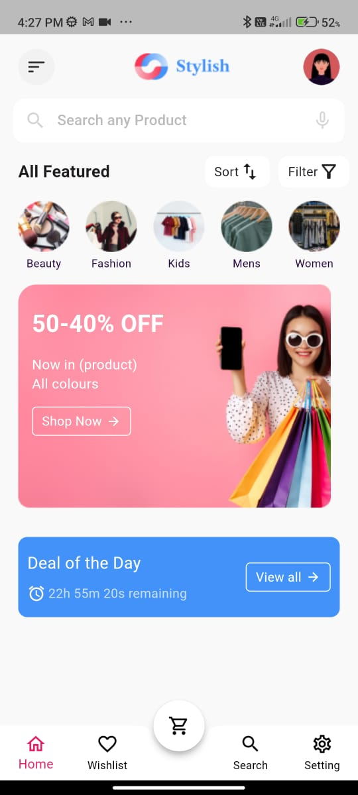

# Stylish - Flutter Prototype
This project is a simple version of the Blassa app prototype, built using Flutter and Firebase. The app includes basic screens such as Splash Screen, Login Screen, Create Account Screen, and Home Screen. The app uses GetX for state management to handle navigation and screen states.

## Technologies Used

- Flutter
- Dart
- Getx
  

## Features Implemented

### 1. **Splash Screen**
   - A welcoming splash screen that is displayed when the app starts.

### 2. **Onboarding Screens**
   - Several onboarding screens are implemented to guide users through the app upon their first launch.

### 3. **Login Screen**
   - Allows users to log in using their email and password.
   - Firebase authentication is used to manage login credentials.

### 4. **Create Account Screen**
   - Allows users to register a new account with their email and password.
   - Firebase authentication is used to create new users.

### 5. **Home Screen**
   - A static home screen that displays basic content.
   - No dynamic data has been implemented in the home screen (for the purpose of this task, it remains static).

## Demo Video

  &nbsp

## Screenshots

  &nbsp
  &nbsp
   &nbsp
  

  &nbsp
  &nbsp
   

